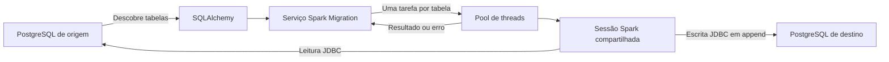

<div align="center">

# Spark Migration

### Um framework concorrente para migração de dados PostgreSQL com Apache Spark

[](https://www.python.org/)
[](https://spark.apache.org/)
[](https://www.postgresql.org/)
[](#status-do-projeto)

Descubra tabelas, execute tarefas concorrentes e transfira dados via JDBC usando uma única sessão Spark compartilhada.

</div>

---

## Visão geral

Spark Migration é um framework Python para copiar dados entre bancos PostgreSQL. Ele combina SQLAlchemy para inspecionar o banco de origem, Apache Spark para transferir os dados via JDBC e um conjunto controlado de threads para processar as tabelas concorrentemente.

A API pública foi projetada para ser simples:

```python
Migration(data=origem, new_data=destino).run()
```

## Recursos

- Descoberta automática das tabelas do banco de origem.
- Leitura e escrita via JDBC com Apache Spark.
- Execução concorrente de até quatro tabelas.
- Uma única sessão Spark compartilhada entre todas as tarefas.
- Até três tentativas para falhas temporárias de leitura.
- Propagação de erros das tarefas para a thread principal.
- Driver JDBC do PostgreSQL incluído no pacote.
- Logs estruturados em inglês.

## Como funciona



1. `Migration` formata as configurações de conexão da origem e do destino.
2. O SQLAlchemy conecta-se à origem e descobre suas tabelas.
3. O serviço cria uma tarefa para cada tabela encontrada.
4. Cada tarefa lê sua tabela em um DataFrame Spark via JDBC.
5. O Spark adiciona o DataFrame à tabela correspondente no destino.
6. A thread principal aguarda os resultados e interrompe a execução quando uma tarefa falha.

## Requisitos

- Python 3.10 ou superior.
- Java 17 disponível no `PATH`.
- Bancos PostgreSQL de origem e destino.
- Acesso de rede aos dois bancos.
- Permissão de leitura nas tabelas de origem.
- Permissões de criação e inserção no destino.

## Instalação

Instale o Spark Migration e suas dependências diretamente pelo PyPI:

```bash
pip install spark_migration
```

Após a instalação, o framework é importado como `Migration`.

## Uso rápido

Mantenha as credenciais fora do código-fonte. Este exemplo utiliza variáveis de ambiente:

```python
import os

from Migration import Migration

origem = {
    "host": os.environ["SOURCE_DB_HOST"],
    "port": int(os.getenv("SOURCE_DB_PORT", "5432")),
    "dbname": os.environ["SOURCE_DB_NAME"],
    "user": os.environ["SOURCE_DB_USER"],
    "password": os.environ["SOURCE_DB_PASSWORD"],
}

destino = {
    "host": os.environ["DESTINATION_DB_HOST"],
    "port": int(os.getenv("DESTINATION_DB_PORT", "5432")),
    "dbname": os.environ["DESTINATION_DB_NAME"],
    "user": os.environ["DESTINATION_DB_USER"],
    "password": os.environ["DESTINATION_DB_PASSWORD"],
}

Migration(data=origem, new_data=destino).run()
```

Execute o arquivo normalmente:

```bash
python spark_migration.py
```

Exemplo de saída:

```text
INFO | Starting Spark session...
INFO | Spark session started.
INFO | Connecting to database postgres...
INFO | Discovered 1 table(s): orders
INFO | Starting database migration...
INFO | Reading table orders (attempt 1/3)
INFO | Table orders written successfully.
INFO | Database migration completed successfully.
```

## Configuração da conexão

Os parâmetros `data` e `new_data` recebem os mesmos campos:

| Campo | Tipo | Descrição |
| --- | --- | --- |
| `host` | `str` | Endereço ou IP do servidor PostgreSQL |
| `port` | `int` | Porta do PostgreSQL, normalmente `5432` |
| `dbname` | `str` | Nome do banco de dados |
| `user` | `str` | Usuário do banco |
| `password` | `str` | Senha do banco |

## Comportamento da escrita

A versão atual utiliza o modo `append` do Spark.

- Se a tabela não existir no destino, o Spark a criará com base no DataFrame.
- Se a tabela já existir, os novos registros serão adicionados.
- Executar a mesma migração mais de uma vez pode duplicar os dados.
- Uma falha durante a escrita pode deixar dados parciais no destino.

Utilize um destino limpo para migrações completas e compare a quantidade de registros na origem e no destino antes de repetir uma execução.

## Escopo e limitações atuais

O framework atualmente migra os registros das tabelas. Ele ainda não reproduz todos os objetos e configurações do PostgreSQL, incluindo:

- chaves primárias e estrangeiras;
- índices e restrições únicas;
- sequências e seus valores atuais;
- views e materialized views;
- triggers e funções armazenadas;
- usuários, permissões e políticas de segurança em nível de linha;
- extensões e configurações do banco.

Em migrações de produção, recrie e valide esses objetos separadamente.

## Observações para Windows

O Spark pode informar que `winutils.exe`, `HADOOP_HOME` ou a biblioteca nativa do Hadoop não estão disponíveis. O framework carrega diretamente o driver JDBC incluído no pacote, portanto esses avisos não impedem o fluxo suportado de migração PostgreSQL.

Se o Spark não iniciar, confirme se o Java 17 está instalado:

```powershell
java -version
```

## Solução de problemas

### `Connection reset`

O banco ou o gerenciador de conexões encerrou a conexão JDBC. O framework repete automaticamente a leitura até três vezes. Se o problema continuar, verifique o estado do banco, a estabilidade da rede, os requisitos de SSL e os limites do pool de conexões.

### `Migration failed`

A thread principal recebeu uma exceção de uma tarefa. Procure o primeiro erro de banco ou Spark exibido antes dessa mensagem; normalmente ele contém a causa real.

### Porta da interface Spark ocupada

O Spark pode selecionar outra porta quando a porta local `4040` já estiver em uso. Isso é apenas informativo e normalmente não impede a migração.

## Segurança

- Nunca inclua senhas de banco ou tokens do PyPI no repositório.
- Prefira variáveis de ambiente ou um gerenciador de segredos.
- Utilize usuários de banco dedicados e com as menores permissões necessárias.
- Troque credenciais que já tenham sido publicadas ou compartilhadas.

## Status do projeto

Spark Migration está em fase **Beta**. A migração de registros entre bancos PostgreSQL está funcional. Modos de escrita idempotentes, migração completa do esquema, validação automática e suporte a outros bancos ainda estão em desenvolvimento.

## Roadmap

- Modos configuráveis `append`, `overwrite` e falha se a tabela existir.
- Validação por quantidade de registros e checksum.
- Migração de esquema, restrições, índices e sequências.
- Filtros para incluir ou excluir tabelas.
- Configuração de concorrência e tentativas.
- Testes automatizados e integração contínua.
- Suporte a outros bancos compatíveis com JDBC.
